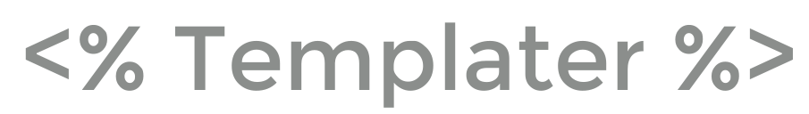

# Templater Obsidian Plugin

[Templater](https://github.com/SilentVoid13/Templater) is a template plugin for [Obsidian.md](https://obsidian.md/). It defines a templating language that lets you insert variables and functions results into your notes. It will also let you execute JavaScript code manipulating those variables and functions.

## Documentation

Check out the complete [documentation](https://silentvoid13.github.io/Templater/) to start using [Templater](https://github.com/SilentVoid13/Templater).

## Warning

[Templater](https://github.com/SilentVoid13/Templater) allows you to execute arbitrary JavaScript code and system commands.

It can be dangerous to execute arbitrary JavaScript code or system commands from untrusted sources. Only run code / commands that you understand, from trusted sources.

## Template Showcase / Questions / Ideas / Help

Go to the [discussion](https://github.com/SilentVoid13/Templater/discussions) tab to ask and find this kind of things.

Don't be shy and share your templates created using [Templater](https://github.com/SilentVoid13/Templater) in the [Template Showcase](https://github.com/SilentVoid13/Templater/discussions/categories/templates-showcase) category. Use [gists](https://gist.github.com/) to share the template file.

## Resources

A list of useful resources about [Templater](https://github.com/SilentVoid13/Templater):

- @GitMurf quick demo `How to setup and run your first Templater JS script`: https://github.com/SilentVoid13/Templater/discussions/187
- @shabegom `How To Use Templater JS Scripts`: https://shbgm.ca/blog/obsidian/how-to-use-templater-js-scripts
- @chhoumann Templates showcase: https://github.com/chhoumann/Templater_Templates
- @zachatoo Templates showcase: https://zachyoung.dev/posts/templater-snippets
- @lguenth Templates showcase: https://github.com/lguenth/obsidian-templates
- @tallguyjenks video: https://youtu.be/2234DXKbNgM?t=1944
- @ProductivityGuru videos: https://www.youtube.com/watch?v=cSawi0tYPMM

## Alternatives

- https://github.com/chhoumann/quickadd
- https://github.com/garyng/obsidian-temple
- https://github.com/avirut/obsidian-metatemplates

## Contributing

Feel free to contribute.

You can create an [issue](https://github.com/SilentVoid13/Templater/issues) to report a bug, suggest an improvement for this plugin, ask a question, etc.

You can make a [pull request](https://github.com/SilentVoid13/Templater/pulls) to contribute to this plugin development.

Check [this](https://silentvoid13.github.io/Templater/internal-functions/contribute.html) to get more information on how to develop a new internal variable / function.

## License

[Templater](https://github.com/SilentVoid13/Templater) is licensed under the GNU AGPLv3 license. Refer to [LICENSE](https://github.com/SilentVoid13/Templater/blob/master/LICENSE.TXT) for more information.

## Support

If you want to support me and my work, you can [sponsor me on Github](https://github.com/sponsors/SilentVoid13) (preferred method) or donate something on [**Paypal**](https://www.paypal.com/donate?hosted_button_id=U2SRGAFYXT32Q).

