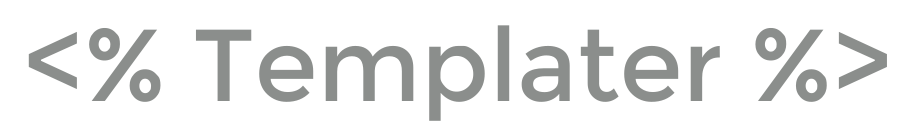

# Templater Obsidian 插件

[English](README.md) | [简体中文](README_zh.md)

[Templater](https://github.com/SilentVoid13/Templater) 是一个为 [Obsidian.md](https://obsidian.md/) 设计的模板插件。它定义了一种模板语言，允许您在笔记中插入变量和函数结果。它还允许您执行 JavaScript 代码来操作这些变量和函数。

## 文档

查看完整的[文档](https://silentvoid13.github.io/Templater/)（[中文版](./docs_zh/src/introduction.md)）开始使用 [Templater](https://github.com/SilentVoid13/Templater)。

## 警告

[Templater](https://github.com/SilentVoid13/Templater) 允许您执行任意 JavaScript 代码和系统命令。

从不受信任的来源执行任意 JavaScript 代码或系统命令可能很危险。只运行您理解的、来自可信来源的代码/命令。

## 模板展示 / 问题 / 想法 / 帮助

前往[讨论](https://github.com/SilentVoid13/Templater/discussions)标签页提问和查找相关内容。

不要害羞，在[模板展示](https://github.com/SilentVoid13/Templater/discussions/categories/templates-showcase)类别中分享您使用 [Templater](https://github.com/SilentVoid13/Templater) 创建的模板。使用 [gists](https://gist.github.com/) 分享模板文件。

## 资源

关于 [Templater](https://github.com/SilentVoid13/Templater) 的有用资源列表：

- @GitMurf 快速演示 `如何设置并运行您的第一个 Templater JS 脚本`：https://github.com/SilentVoid13/Templater/discussions/187
- @shabegom `如何使用 Templater JS 脚本`：https://shbgm.ca/blog/obsidian/how-to-use-templater-js-scripts
- @chhoumann 模板展示：https://github.com/chhoumann/Templater_Templates
- @zachatoo 模板展示：https://zachyoung.dev/posts/templater-snippets
- @lguenth 模板展示：https://github.com/lguenth/obsidian-templates
- @tallguyjenks 视频：https://youtu.be/2234DXKbNgM?t=1944
- @ProductivityGuru 视频：https://www.youtube.com/watch?v=cSawi0tYPMM

## 替代方案

- https://github.com/chhoumann/quickadd
- https://github.com/garyng/obsidian-temple
- https://github.com/avirut/obsidian-metatemplates

## 贡献

欢迎您做出贡献。

您可以创建一个 [issue](https://github.com/SilentVoid13/Templater/issues) 来报告错误、提出改进建议、提问等。

您可以提交 [pull request](https://github.com/SilentVoid13/Templater/pulls) 来为该插件的开发做出贡献。

查看[这里](https://silentvoid13.github.io/Templater/internal-functions/contribute.html)获取有关如何开发新的内置变量/函数的更多信息。

## 许可证

[Templater](https://github.com/SilentVoid13/Templater) 使用 GNU AGPLv3 许可证。更多信息请参考 [LICENSE](https://github.com/SilentVoid13/Templater/blob/master/LICENSE.TXT)。

## 支持

如果您想支持我和我的工作，您可以[在 Github 上赞助我](https://github.com/sponsors/SilentVoid13)（首选方法）或在 [**Paypal**](https://www.paypal.com/donate?hosted_button_id=U2SRGAFYXT32Q) 上捐赠。

