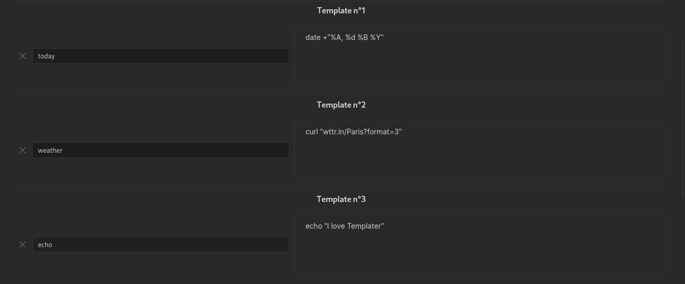

# System Command User Functions

This type of user functions allows you to execute system commands and retrieve their output.

System command user functions need to be enabled in Templater's settings.

## Define a System Command User Function

To define a new system command user function, you need to define a **function name**, associated with a **system command**.

To do that, go to the plugin's settings and click `Add User Function`.

Once this is done, [Templater](https://github.com/SilentVoid13/Templater) will create a user function named after what you defined, that will execute your system command and return its output.

Just like internal functions, user functions are available under the `tp` JavaScript object, and more specifically under the `tp.user` object.

## Functions Arguments

You can pass optional arguments to user functions. They must be passed as a single JavaScript object containing properties and their corresponding values: `{arg1: value1, arg2: value2, ...}`.

These arguments will be made available for your programs / scripts in the form of [environment variables](https://en.wikipedia.org/wiki/Environment_variable).

In our previous example, this would give the following command declaration: `<% tp.user.echo({a: "value 1", b: "value 2"})`. 

If our system command was calling a bash script, we would be able to access variables `a` and `b` using `$a` and `$b`.

## Internal functions in system commands

You can use internal functions inside your system command. The internal functions will be replaced before your system command gets executed.

For example, if you configured the system command `cat <% tp.file.path() %>`, it would be replaced with `cat /path/to/file` before the system command gets executed.